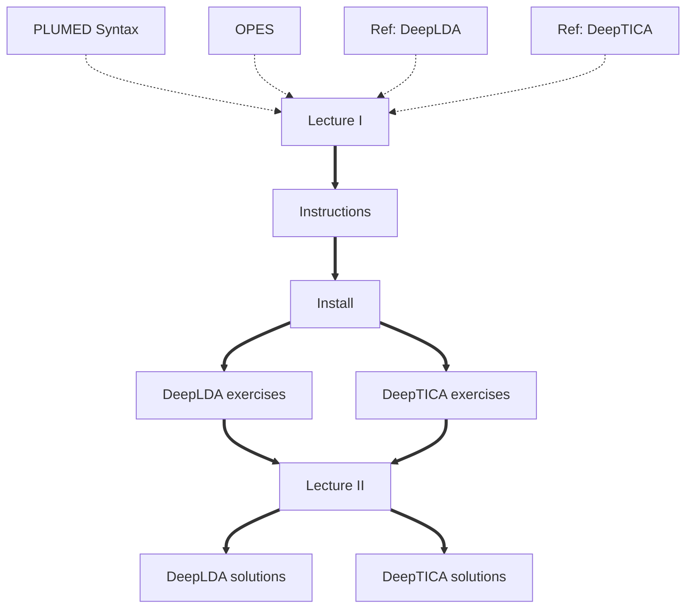

# Masterclass 22.05: Machine learning collective variables with Pytorch

This Masterclass describes how to design data-driven collective variables using machine learning (ML) methods. In particular, two methods will be presented. In the first (DeepLDA), the CVs are optimized as classifiers to distinguish metastable states. In the second (DeepTICA) the slow modes of the simulations are extracted from a (biased) simulation and used as CVs. 

This lesson was given as part of the PLUMED masterclass series in 2022.  It includes:

* A first videos that describes the theory.
* Python notebooks that contain the exercises.
* A second video with the discussion and the solution of the exercises. 
* Python notebooks containing the solution to the exercises.

The flow chart shown below indicates the order in which you should consult the resources.  You can click on the nodes to access the various resources.  Follow the thick black lines for the best results.  The resources that are connected by dashed lines are supplmentary resources that you may find useful when completing the exercise.

This lesson was the fifth masterclass in the 2022 series.

## References
1. Bonati, Rizzi and Parrinello, [Data-Driven Collective Variables for Enhanced Sampling](https://pubs.acs.org/doi/full/10.1021/acs.jpclett.0c00535), JPCL (2020)
2. Bonati, Piccini and Parrinello, [Deep learning the slow modes for rare events sampling](https://doi.org/10.1073/pnas.2113533118), PNAS(2021)
